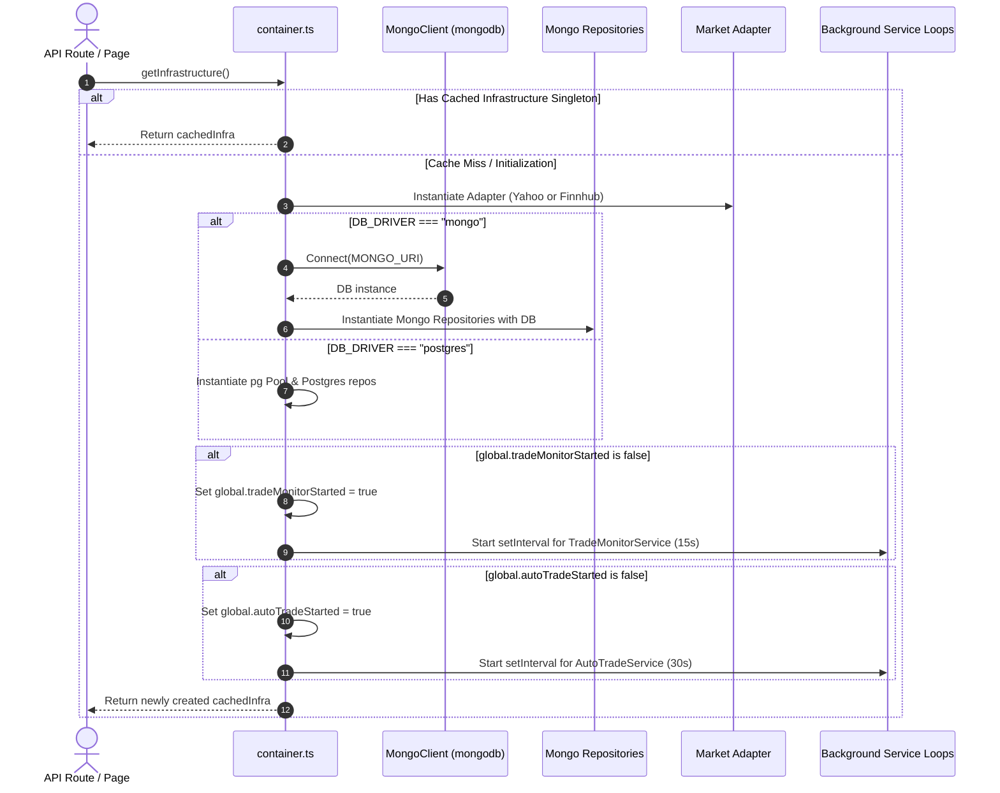
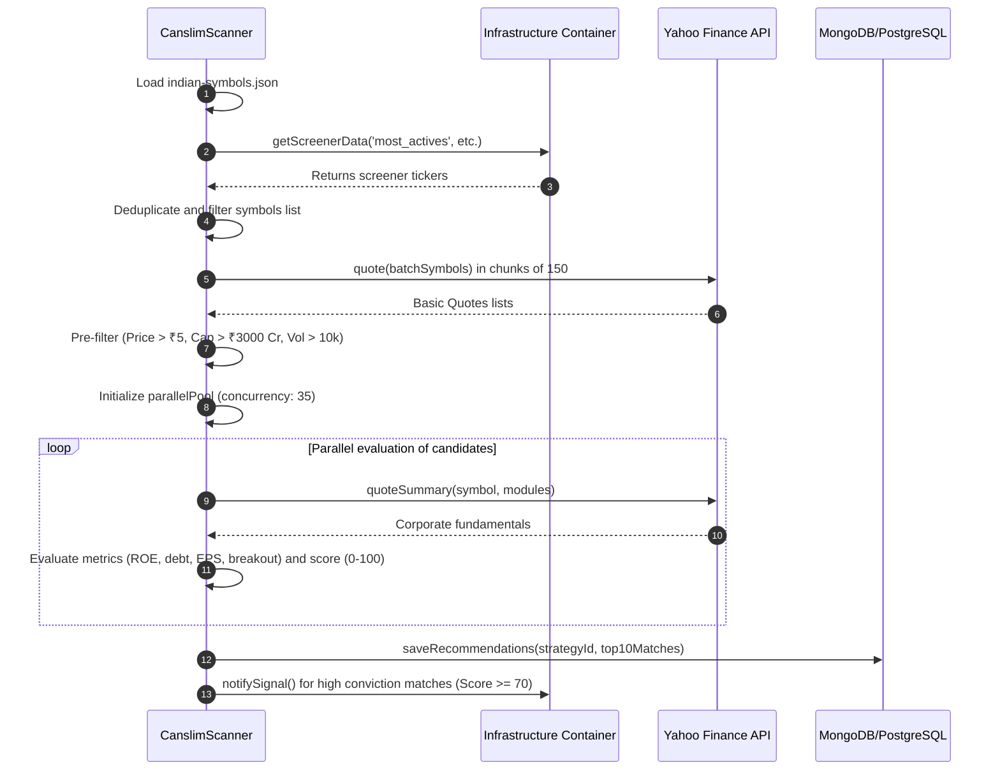

# StockIntel Core Files Implementation Analysis

This document provides a detailed code audit and architectural analysis of four key files in the **StockIntel** codebase:
1. `src/infrastructure/container.ts` (Dependency Injection & Daemons)
2. `src/ports/market-data-port.ts` (Market Data Gateway Interface)
3. `src/adapters/yahoo/market-adapter.ts` (Yahoo Finance Client Adapter)
4. `src/services/quant-scanner.ts` (Quantitative Strategy Scanners)

---

## 1. File: `src/infrastructure/container.ts`

### Full Responsibility
*   **Dependency Resolution (DI)**: Acts as the IoC (Inversion of Control) entry point via `getInfrastructure()`, instantiating concrete database repositories and market data clients based on environment flags (`DB_DRIVER`, `FINNHUB_API_KEY`).
*   **Daemon Orchestration**: Starts the background loops (`TradeMonitorService` every 15 seconds, and `AutoTradeService` every 30 seconds) on application startup.
*   **Process Protection**: Guards against duplicate background executions in development environments by registering state variables on the Node.js `global` context.

### Dependency Graph
```
                     +---------------------------+
                     | src/infrastructure/container.ts |
                     +-------------+-------------+
                                   |
         +-------------------------+-------------------------+
         |                         |                         |
         v                         v                         v
+--------+--------+       +--------+--------+       +--------+--------+
| Ports/Interfaces|       | Concrete Repos  |       | Background Daemons
|  (Ports folder) |       | (Adapters folder|       | (TradeMonitor/  |
|                 |       |  Mongo/Postgres)|       |  AutoTrade)     |
+-----------------+       +-----------------+       +-----------------+
```

### Call Flow


### Code Audit
*   **Performance Concerns**:
    *   Dynamic imports (`require`) inside background intervals occur on every loop step. This causes runtime overhead and prevents bundle tree-shaking.
    *   Establishing DB connections inside `getInfrastructure` halts the request thread if the database is slow to respond during initial cold-start.
*   **Code Smells**:
    *   Polluting the Node `global` object (`(global as any).tradeMonitorStarted`) for daemon flags.
    *   Casting empty mocks (`{} as any`) for multiple repositories in PostgreSQL mode.
*   **Hidden Bugs**:
    *   If `DB_DRIVER=postgres` is set, accessing repositories like user, watchlist, analytics, strategy, alert, or notification will immediately throw runtime property errors, as they are initialized as empty mock objects.
*   **Scalability Risks**:
    *   **Vercel/Serverless Deployment**: In Vercel or AWS Lambda environments, background `setInterval` timers are suspended as soon as the API response completes. The daemons will fail to execute unless hosted on a persistent VM or container (e.g. AWS ECS, Heroku).
    *   **Horizontally Scaled Nodes**: If the API runs on multiple server nodes, each instance will spawn its own background loop, causing concurrent duplicates (double execution) of limit orders and auto-trade decisions unless a distributed lock is used.
*   **DhanHQ Integration Point**:
    *   At line 77, check for Dhan provider environment variables:
    ```typescript
    const marketAdapter = process.env.MARKET_PROVIDER === 'dhan'
        ? new DhanHQMarketAdapter(process.env.DHAN_CLIENT_ID || '', process.env.DHAN_ACCESS_TOKEN || '')
        : apiKey
            ? new FinnhubMarketAdapter(apiKey)
            : new YahooFinanceMarketAdapter();
    ```

---

## 2. File: `src/ports/market-data-port.ts`

### Full Responsibility
*   **Boundary Definition**: Defines the `MarketDataPort` interface, enforcing a contract for all market integrations and keeping the core application logic clean and decoupled from third-party vendor APIs.

### Dependency Graph
```
[src/domain/stock.ts] (Stock Type)
         ^
         | (Imports)
[src/ports/market-data-port.ts] (Interface Contract)
         ^
         | (Implements)
[src/adapters/*] (Yahoo & Finnhub Adapters)
```

### Code Audit
*   **Performance Concerns**: None. It is a compile-time interface declaration.
*   **Code Smells**:
    *   Uses untyped arrays (`any[]`) for `getHistoricalData` and `getNews`, reducing type safety.
*   **Hidden Bugs**: None.
*   **Scalability Risks**:
    *   If a broker provider does not support corporate fundamental modules (e.g., debt, margins, ROE), the implementing class must return empty values, forcing downstream components to handle exceptions.
*   **DhanHQ Integration Point**:
    *   None needed. DhanHQ adapter simply implements this interface contract.

---

## 3. File: `src/adapters/yahoo/market-adapter.ts`

### Full Responsibility
*   **Yahoo API Wrapper**: Implements `MarketDataPort` using the `yahoo-finance2` library.
*   **Fundamentals Mapping**: Normalizes unstructured statistics, financial sheets, and metrics from Yahoo Finance into the `Stock` domain structure.
*   **Smart Fallback Screeners**: Implements a regional fallback algorithm for NSE/BSE stocks when Yahoo's default screener fails.

### Dependency Graph
```
                     +---------------------------------------+
                     | src/adapters/yahoo/market-adapter.ts  |
                     +---+-------------------+-----------+---+
                         |                   |           |
                         v                   v           v
             +-----------+----+     +--------+------+  +-+-------------+
             | yahoo-finance2 |     | CacheUtils    |  | indian-       |
             | library        |     | (Memory cache)|  | symbols.json  |
             +----------------+     +---------------+  +---------------+
```

### Call Flow: Screener Fallback
```mermaid
graph TD
    A[getScreenerData(scrId)] --> B{Try yahooFinance.screener}
    B -- Succeeded & Has Indian Currency --> C[Return Yahoo Results]
    B -- Fails or Returns US Stocks --> D[Load indian-symbols.json]
    D --> E[Add core seed symbols RELIANCE.NS, TCS.NS, etc.]
    E --> F[Select random sample of 150 symbols]
    F --> G[Execute batch quote call quoteBatch]
    G --> H[Sort results on server based on change/volume]
    H --> I[Save to Cache & Return Top Lists]
```

### Code Audit
*   **Performance Concerns**:
    *   `getStockPrice` issues two HTTP calls in parallel (`quote` and `quoteSummary`). For heavy scanner deep-dives, this generates overhead.
    *   In the screener fallback, loading the JSON via `fs.readFileSync` blocks the single-threaded event loop.
*   **Code Smells**:
    *   Synchronous file system reads (`fs.readFileSync`) in asynchronous methods.
    *   Manual and resource-intensive array shuffle logic: `allSymbols.sort(() => 0.5 - Math.random())`.
*   **Hidden Bugs**:
    *   `withRetry` only catches `ECONNRESET` or `fetch failed`. Socket timeouts (`ETIMEDOUT`) or DNS issues (`ENOTFOUND`) are not caught, causing calls to fail immediately without retry.
*   **Scalability Risks**:
    *   Yahoo Finance is an unofficial API; structural changes in Yahoo's web feeds can break the adapter completely.
*   **Refactoring Suggestions**:
    *   Cache the contents of `indian-symbols.json` in memory at app startup instead of reloading it from the disk on every fallback event.
    *   Replace `allSymbols.sort(() => 0.5 - Math.random())` with a high-performance Fisher-Yates shuffle algorithm to reduce CPU complexity from $O(N \log N)$ to $O(N)$.
    *   Use asynchronous file operations: `await fs.promises.readFile(...)`.

---

## 4. File: `src/services/quant-scanner.ts`

### Full Responsibility
*   **Algorithmic Screening**: Houses multiple strategy scanner systems (`CanslimScanner`, `BuffetScanner`, etc.) that pull data, process stocks, calculate confluence ratings, and save high-conviction setup recommendations.

### Dependency Graph
```
                     +---------------------------------------+
                     |     src/services/quant-scanner.ts     |
                     +---+-------------------+-----------+---+
                         |                   |           |
                         v                   v           v
             +-----------+----+     +--------+------+  +-+-------------+
             | yahoo-finance2 |     | Infrastructure|  | Notification  |
             | (Direct import)|     | Container     |  | Service       |
             +----------------+     +---------------+  +---------------+
```

### Call Flow: CANSLIM Scanner


### Code Audit
*   **Performance Concerns**:
    *   The `parallelPool` concurrency limit of 35 executes up to 35 parallel HTTPS requests to Yahoo Finance's `quoteSummary`. This high volume of concurrent traffic regularly triggers rate limit blocks (HTTP 429) or socket exceptions.
    *   Scans process heavy computational tasks synchronously, which blocks the Node.js event thread.
*   **Code Smells**:
    *   **Tight Coupling**: Imports `yahoo-finance2` directly, bypassing the `MarketDataPort` interface. If DhanHQ is selected, the scanner will still hit Yahoo Finance.
    *   **Duplicate Code**: Significant copy-paste redundancy between scanners (`BuffetScanner`, `SwingScanner`, etc.) for array chunking, pool execution, and symbol loading.
*   **Hidden Bugs**:
    *   Scanners use a mock Ma200 proxy: `(fiftyTwoWeekHigh + fiftyTwoWeekLow) / 2`. This is a poor approximation that can cause inaccurate breakout calculations.
*   **Scalability Risks**:
    *   Synchronous, on-demand execution inside HTTP threads risks server request timeouts (e.g. Vercel's 10-second limit).
*   **DhanHQ Integration Point**:
    *   To support DhanHQ, remove the direct `yahoo-finance2` import and update the scanner to use `this.infra.market` for batch quotes and stock detail fetches.
*   **Refactoring Suggestions**:
    *   Create a common `BaseScanner` abstract class to centralize loading, chunking, and task pool executors (DRY).
    *   Add a `getBatchQuotes` method to `MarketDataPort` so batch calls can go through the dependency container instead of directly importing Yahoo.
    *   Move scans to background cron jobs (e.g., using BullMQ) rather than running them inside API requests.
