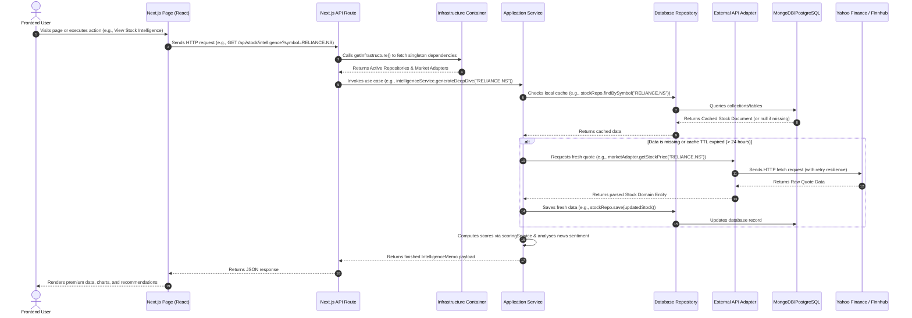

# StockIntel Architectural Analysis Report

This report provides a detailed breakdown of the complete project structure, routing architecture, API endpoints, services, authentication, database setup, state management, external integrations, and the end-to-end data flow for **StockIntel**.

---

## 1. Top-Level Folder Structure

The project follows a **Clean Architecture / Domain-Driven Design (DDD)** pattern, separating concerns into distinct layers: Domain (business rules), Application (use cases), Adapters (gateways/interfaces to database & API clients), and Ports (abstractions/interfaces).

```
stock_intel/
├── .env.example                # Template for environment variables
├── next.config.mjs             # Next.js configurations
├── package.json                # Project dependencies and run scripts
├── postcss.config.js           # PostCSS setup for styling
├── tailwind.config.js          # Tailwind CSS design system settings
├── tsconfig.json               # TypeScript configurations
├── scripts/                    # Utility scripts (e.g. testing and resilience)
└── src/                        # Main source code directory
    ├── app/                    # Next.js App Router (pages, layouts, and API routes)
    ├── domain/                 # Core entities, interfaces, and business logic
    ├── ports/                  # Interface contracts (abstractions) for repositories and APIs
    ├── adapters/               # Concrete database repositories and external API implementations
    ├── application/            # Application logic, scoring engines, and services
    ├── services/               # System-wide services (e.g., scanners)
    ├── infrastructure/         # Dependency injection container, configurations, and cache utils
    ├── components/             # Reusable UI components, layout sections, charts, and theme providers
    └── lib/                    # Shared core helpers and utility functions
```

---

## 2. Complete Route/Page Structure

The frontend pages are housed within `src/app` using Next.js route groups (`(auth)` and `(dashboard)`):

```
src/app/
├── globals.css                 # Global styling rules
├── layout.tsx                  # Root HTML layout wrapper
├── loading.tsx                 # Global loading/suspense indicator
├── (auth)/                     # AUTHENTICATION ROUTE GROUP
│   └── auth/
│       ├── login/
│       │   └── page.tsx        # Sign-in portal
│       ├── register/
│       │   └── page.tsx        # Registration portal
│       └── forgot-password/
│           └── page.tsx        # Password reset portal
└── (dashboard)/                # PROTECTED DASHBOARD ROUTE GROUP
    ├── layout.tsx              # Main dashboard wrapper (Sidebar, User profile, Header)
    ├── loading.tsx             # Dashboard-specific loading skeleton
    ├── page.tsx                # Main Wealth Dashboard Home page (navigates to DashboardClient)
    ├── dashboard-client.tsx    # Client-side shell for main dashboard stats
    ├── timeframe-selector.tsx  # Shared selector for charts
    ├── market/
    │   ├── page.tsx            # Market scan landing page
    │   └── market-scan-client.tsx # Client-side scan layout
    ├── stock/
    │   └── [symbol]/
    │       ├── page.tsx        # Deep-dive individual stock page
    │       └── stock-detail-client.tsx # Client dashboard for a single asset
    ├── portfolio/
    │   ├── page.tsx            # Portfolio tracker page
    │   └── portfolio-client.tsx # Live positions / Quant history client hub
    ├── comparison/
    │   └── page.tsx            # Compare multiple stocks comparison view
    ├── strategy/
    │   └── [id]/
    │       ├── page.tsx        # Strategy details & configuration page
    │       └── strategy-client.tsx # Client controller for managing backtesting strategies
    ├── journal/
    │   └── page.tsx            # Trader ledger / journal view
    ├── backtesting/
    │   └── page.tsx            # Algorithmic backtesting environment
    ├── auto-trade/
    │   ├── page.tsx            # Automated bot manager dashboard
    │   └── auto-trade-client.tsx # Client controller for bots
    ├── leaderboard/
    │   ├── page.tsx            # Portfolios leaderboard rankings page
    │   └── leaderboard-client.tsx # Client controller for rankings
    ├── search/
    │   └── page.tsx            # Unified search results page
    ├── profile/
    │   └── [id]/
    │       └── page.tsx        # User profile configuration page
    └── news/
        ├── page.tsx            # Aggregate market sentiment news portal
        └── news-client.tsx     # Sentiment news client shell
```

---

## 3. API Route Structure

All API endpoints are structured under `src/app/api` and handle communication between client interactions and backend business logic:

```
src/app/api/
├── auth/
│   └── [...nextauth]/
│       └── route.ts            # NextAuth JWT-based auth handler
├── register/
│   └── route.ts                # Account creation API endpoint
├── profile/
│   └── [id]/
│       └── route.ts            # View and update user profile data
├── portfolio/
│   ├── me/
│   │   └── route.ts            # Get current logged-in user's portfolio
│   ├── reset/
│   │   └── route.ts            # Nuclear wipe and reset of simulation portfolio
│   ├── add-funds/
│   │   └── route.ts            # Deposit virtual capital
│   ├── analytics/
│   │   └── route.ts            # Performance analytics (Sharpe ratio, volatility)
│   └── journal/
│       └── route.ts            # Retrieve trading journal records
├── trade/
│   ├── route.ts                # POST handler to execute a BUY/SELL instantly
│   ├── limit/
│   │   └── route.ts            # GET/POST/DELETE for pending limit orders
│   └── history/
│       └── route.ts            # Retrieve log of completed trades
├── stock/
│   ├── intelligence/
│   │   └── route.ts            # Generate and fetch AI-driven Stock Intelligence memos
│   ├── search/
│   │   └── route.ts            # Search tickers via Yahoo Finance
│   ├── alerts/
│   │   └── route.ts            # Manage user price alerts
│   ├── news/
│   │   └── route.ts            # Fetch relevant news for a stock symbol
│   ├── history/
│   │   └── route.ts            # Fetch historical quote charts
│   └── performance/
│       └── route.ts            # Get performance returns (1M, 3M, 1Y, YTD, etc.)
├── market/
│   ├── status/
│   │   └── route.ts            # Get current market status (Open/Closed)
│   ├── scan/
│   │   └── route.ts            # Fetch stock screener lists (Gainers, Losers, Actives)
│   ├── indices/
│   │   └── route.ts            # Get indices performance (Nifty 50, Sensex)
│   ├── live/
│   │   └── route.ts            # Fetch batch of real-time quotes
│   └── all-data/
│       └── route.ts            # Combined dashboard API aggregating indices, scanner, and news
├── auto-trade/
│   ├── route.ts                # Create/List automated trading bots
│   ├── trigger/
│   │   └── route.ts            # Manually trigger bot execution
│   └── [id]/
│       ├── route.ts            # Retrieve/Update/Delete a specific bot
│       └── history/
│           └── route.ts        # Get bot trade execution logs
├── strategy/
│   ├── route.ts                # Create/List custom trading strategies
│   └── [id]/
│       ├── route.ts            # Get/Update/Delete a specific strategy
│       ├── scan/
│       │   └── route.ts        # Query current stocks filtering by strategy rules
│       └── backtest/
│           ├── init/
│           │   └── route.ts    # Start backtesting run for a strategy
│           └── batch/
│               └── route.ts    # Process backtesting metrics in batches
├── sim/
│   ├── monitor/
│   │   └── route.ts            # Manually poll/trigger the limit order monitor daemon
│   └── backtest/
│       └── route.ts            # General simulation helper endpoint
└── notifications/
    └── route.ts                # Fetch/dismiss user notification logs
```

---

## 4. Services and Utility Folders

Application-specific workflows and helper logic reside in `src/application`, `src/lib`, and `src/services`:

*   **`src/application/` (Core Application Services)**:
    *   `scoring-service.ts`: Computes custom 0-100 scores based on fundamentals, technicals, liquidity, risk, and momentum variables.
    *   `intelligence-service.ts`: Coordinates find-or-fetch operations for deep dives, news sentiment analysis, and action recommendations (BUY/SELL/HOLD).
    *   `ai-copilot.ts`: Formulates responses for comparisons, risk evaluations, and valuations based on heuristic queries.
    *   `trade-monitor-service.ts`: The background simulation engine that scans pending limit orders and matches them against current market quotes.
    *   `auto-trade-service.ts`: Coordinates automated bots, checking indicators and executing trades based on defined rules.
    *   `backtest-service.ts`: Simulates strategy performance on historical quote logs.
    *   `portfolio-analyzer.ts`: Performs Sharpe Ratio, Drawdown, and volatility calculations.
    *   `news-service.ts`: Pulls market-wide reporting, runs keyword sentiment analysis, and reports overall direction.
    *   `notification-service.ts`: Creates alerts and notifications in response to trigger events (e.g. executed orders).
    *   `bot-stats-calculator.ts`: Computes success ratios and metrics for active trading bots.
*   **`src/services/` (Quant Scanner)**:
    *   `quant-scanner.ts`: A tool used to scan and score stocks according to custom quantitative models.
*   **`src/lib/` (Core Library Utilities)**:
    *   `utils.ts`: Formatter functions (currency, Indian numbering system) and class merge wrappers (`cn`).
    *   `auth.ts`: Configurations for NextAuth credentials providers, session limits, callback injections, and bcrypt validation.
    *   `market.ts`: Market configuration variables and symbol formatters.

---

## 5. Models/Schema Folders

The application models are structured as clean TypeScript entities in the **`src/domain/`** folder. They define interfaces rather than ORM/ODM models, leaving data access to the repositories (adapters):

*   `stock.ts`: Defines `Stock` properties (price, volume, debt, margin, etc.) and `StockScore` shape.
*   `portfolio.ts`: Defines `Holding`, `Portfolio` entity structure, and `PortfolioStats` metadata.
*   `trade.ts`: Defines the ledger structure for records of transactions.
*   `limit-order.ts`: Defines `LimitOrder` schema and status categories (`PENDING`, `EXECUTED`, `CANCELLED`, `EXPIRED`).
*   `auto-trade-bot.ts`: Configuration details of automated trading bots (strategy, asset, budget).
*   `watchlist.ts`: Tracks watchlists.
*   `strategy.ts`: Defines rules, indicators, and setups for trading models.
*   `analytics.ts`: Interface structures for performance reporting.

*Note: Database-specific schemas/serialization are handled directly inside the repository adapters (`src/adapters/mongodb/` and `src/adapters/postgres/`).*

---

## 6. Authentication-Related Files

StockIntel uses **NextAuth.js** with a credentials-based authentication mechanism:

*   **`src/lib/auth.ts` (Configuration)**: Defines credentials options, maps authentication requests, queries user details via the user repository, validates passwords using `bcryptjs`, sets session strategy to `JWT`, and formats user session payloads.
*   **`src/app/api/auth/[...nextauth]/route.ts` (API route)**: Standard NextAuth wildcard wrapper that hooks into Next.js App Router requests.
*   **`src/middleware.ts` (Request Middleware)**: Checks incoming requests for standard (`next-auth.session-token`) or secure (`__Secure-next-auth.session-token`) session cookies, redirecting unauthorized dashboard attempts to `/auth/login` while preserving the callback path.
*   **`src/components/auth-provider.tsx` (Session Wrapper)**: Wrap-around component exposing NextAuth session contexts to client routes.

---

## 7. Database Connection Files

The project has a flexible database interface system configured in the infrastructure layer:

*   **`src/infrastructure/container.ts` (DI Container & Connection Manager)**:
    *   Reads `DB_DRIVER` to decide between `mongo` and `postgres`.
    *   In **MongoDB mode**, it connects via `MongoClient.connect()` with `MONGO_URI`, targeting the `MONGO_DB` database, and registers MongoDB adapters.
    *   In **PostgreSQL mode**, it connects via `pg.Pool` using `POSTGRES_URL` and hooks PostgreSQL adapters for stock and portfolio repositories.
    *   Initializes background daemons (`TradeMonitorService` every 15 seconds, and `AutoTradeService` every 30 seconds) inside a global singleton checker to prevent multi-process overlapping.

---

## 8. State Management Approach

The project avoids complex external stores (like Redux or Zustand) and opts for:

1.  **Next.js Server Actions / Page Data Retrieval**: Pages query data initially via server fetches and propagate them down as properties.
2.  **Standard Client-Side React Hooks**: `useState`, `useEffect`, `useCallback`, and `useReducer` maintain and modify active state (e.g. tracking tabs, forms, input quantities, and triggering intervals to poll API updates).
3.  **React Context Providers**: Global contexts share UI notifications, loader events, user sessions, and design themes.

---

## 9. Global Providers

The app wraps child routes using the unified **`src/components/providers.tsx`** entry point, housing the following providers:

1.  **`ThemeProvider` (`src/components/theme/ThemeProvider.tsx`)**: Controls Dark Mode / Light Mode styling class triggers.
2.  **`AuthProvider` (`src/components/auth-provider.tsx`)**: Exposes NextAuth context to ensure session persistence across navigation.
3.  **`LoaderProvider` (`src/components/ui/loader-provider.tsx`)**: Manages the global loading screen and provides control methods (`showLoader()`, `hideLoader()`).
4.  **`SnackbarProvider` (`src/components/ui/snackbar.tsx`)**: Exposes the application-wide notification toasts interface (`showSnackbar()`).

---

## 10. External Integrations

StockIntel integrates with external stock market and news data sources through adapters:

*   **Yahoo Finance (`yahoo-finance2`)**:
    *   Implemented in `src/adapters/yahoo/market-adapter.ts`.
    *   Fetches real-time price quotes, summary data (e.g., P/E, EPS, ROE, cash flow), historical candles (standard and intraday), tickers search, market screeners, and financial news items.
    *   **NSE/BSE Smart Fallback**: If the Yahoo Finance screener returns no data or defaults to US assets, the adapter falls back to `src/data/indian-symbols.json` (housing ~8k Indian symbols), pulls quotes in batches, and performs manual client-side sorting for gainers, losers, and actives.
*   **Finnhub API**:
    *   Implemented in `src/adapters/finnhub/market-adapter.ts`.
    *   Activated as the primary market adapter when `FINNHUB_API_KEY` is set in the environment variables (primarily used for US stock quotes and historical daily chart data).
*   **Local In-Memory Cache**:
    *   `src/infrastructure/cache-utils.ts` implements a key-value caching layer with Time-To-Live (TTL) checks to stay compliant with external API rate limits.

---

## 11. Middleware Files

*   **`src/middleware.ts`**:
    *   Applies protection rules to all dashboard and user configuration pages.
    *   Bypasses validation for static files (`/_next`, `/favicon.ico`), the root auth pages (`/auth/login`, `/auth/register`), and authentication endpoints (`/api/auth`, `/api/register`).
    *   Redirects unauthenticated visitors to `/auth/login?callbackUrl=<requested_route>`.

---

## 12. Shared Reusable Components

StockIntel uses modular UI elements in the `src/components` folder:

*   **`src/components/ui/`**: Core items including `global-loader.tsx`, `snackbar.tsx`, `tooltip.tsx`, and `notifications-popover.tsx`.
*   **`src/components/charts/`**:
    *   `InteractiveChart.tsx`: A professional candle/area chart built with `lightweight-charts` or `recharts` to render real-time and historical price actions.
    *   `DynamicPerformanceSection.tsx`: Volatility curves and return stats dashboards.
*   **`src/components/alerts/`**:
    *   `AlertManager.tsx`: Interactive forms to create, list, and delete custom price triggers.
*   **`src/components/portfolio/`**:
    *   `Heatmap.tsx`: A tree-map representing holdings concentration.
    *   `TraderJournal.tsx`: Layout showing trade listings, notes, and log details.
    *   `BacktestSimulator.tsx`: UI panel to configure variables and run test simulations.
*   **`src/components/stock/`**:
    *   `IntelligenceMemo.tsx`: Render shell showing scores breakdown, radar maps, and recommendations.
    *   `NewsSentiment.tsx`: News ticker list showcasing individual sentiment meters (Bullish/Bearish/Neutral).
*   **`src/components/theme/`**: Layout switch toggle buttons to swap CSS color schemes.

---

## 13. Environment Variables Used

The system expects the following environment variables (defined in `.env.example`):

*   `DB_DRIVER`: Driver selector (`mongo` or `postgres`).
*   `MONGO_URI`: MongoDB connection string.
*   `MONGO_DB`: MongoDB database name.
*   `POSTGRES_URL`: PostgreSQL connection string (when `DB_DRIVER=postgres`).
*   `FINNHUB_API_KEY`: API token for Finnhub REST integration.
*   `NEXTAUTH_URL`: Canonical root URL for redirect callbacks.
*   `NEXTAUTH_SECRET`: Hash secret key used to sign JWT tokens.
*   `CRON_SECRET`: Authorization key for background processes.

---

## 14. E2E Data Flow (Frontend → Backend → Database → External APIs)

The diagram and narrative below explain how a typical request flows through the clean architecture layers of StockIntel:



### Flow Step-by-Step Explanation:

1.  **Frontend Request**: A user navigates to the stock detail page or requests analysis. The client component initiates a fetch request to `/api/stock/intelligence?symbol=RELIANCE.NS`.
2.  **API Routing**: Next.js route parses the query parameter. It invokes the DI container `getInfrastructure()`.
3.  **Dependency Resolution**: The container checks environmental variables. If `DB_DRIVER` is `mongo`, it ensures a `MongoClient` connection is open, resolves dependencies, and hooks `MongoStockRepository` and `YahooFinanceMarketAdapter` before serving them.
4.  **Use Case Execution**: The route executes `IntelligenceService.generateDeepDive("RELIANCE.NS")`.
5.  **Database Lookup**: `IntelligenceService` asks `MongoStockRepository` for the symbol in the database.
6.  **External API Query (Fallback)**: If the document is missing or stale (created over 24 hours ago), a refresh triggers. The `YahooFinanceMarketAdapter` communicates with Yahoo Finance, queries the live quote, fetches default key statistics (ROE, margins, debt metrics), parses it into a standard `Stock` domain structure, caches it by calling `stockRepo.save()`, and returns it.
7.  **Scoring and Heuristics**: The service calls `ScoringService.calculateScore(stock)` which applies the mathematical weights to calculate individual component ratings (Fundamental, Technical, Liquidity, Risk, Momentum) and the overall score.
8.  **Sentiment Scanning**: The service queries news using the market adapter, feeds the articles to `NewsService.calculateSentiment()` (matching keyword matrices), and assigns a directional trend (BULLISH/BEARISH/NEUTRAL).
9.  **Response Render**: The compiled `IntelligenceMemo` is returned as a JSON response. The React components ingest this data, trigger animations, and populate charts (e.g. Recharts graphs, custom gauge indicators) to present the details to the user.
10. **Background Automation**: Concurrently, the container-backed background monitors (`TradeMonitorService` and `AutoTradeService`) run in the background, matching live quotes against pending database orders, executing trades, modifying cash balances, and saving completed trade receipts to the database ledger.
