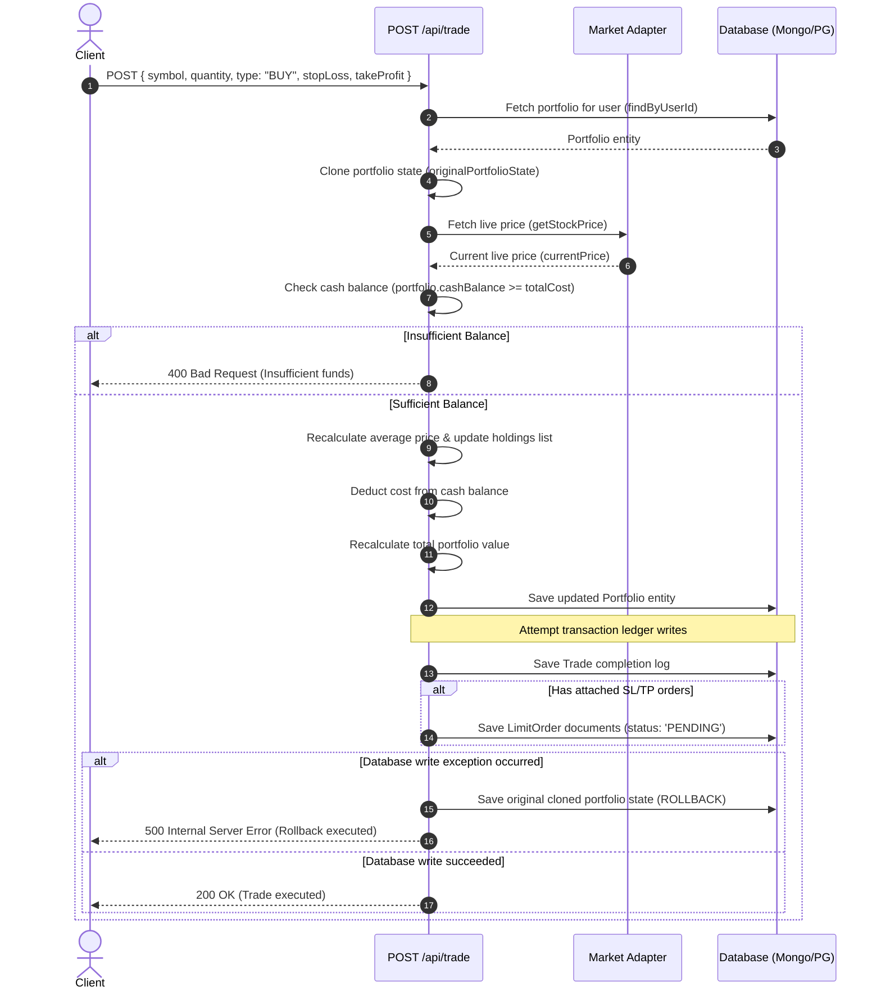
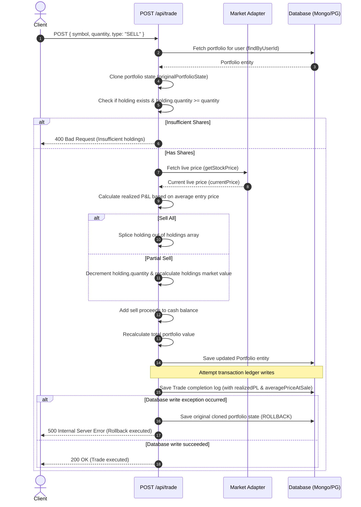

# StockIntel Trading Execution & Portfolio System Analysis

This document outlines the architecture, data models, math formulas, and background services governing the trading engine and portfolio simulation inside **StockIntel**.

---

## 1. Core Mathematical Calculations

### Average Price Calculation
When an asset is bought, its entry cost must be correctly amortized over the new total holdings.
$$\text{New Average Price} = \frac{(\text{Existing Qty} \times \text{Existing Avg Price}) + (\text{Executed Cost})}{\text{Existing Qty} + \text{New Qty}}$$
*   **Existing Qty**: Units currently held.
*   **Existing Avg Price**: Amortized purchase price prior to this transaction.
*   **Executed Cost**: $\text{New Quantity} \times \text{Execution Price}$.

### P&L Calculations
*   **Unrealized P&L (Paper gains/losses)**:
    $$\text{Unrealized P\&L} = (\text{Current Live Price} - \text{Average Price}) \times \text{Holding Quantity}$$
    $$\text{Unrealized P\&L \%} = \frac{\text{Current Live Price} - \text{Average Price}}{\text{Average Price}} \times 100$$
*   **Realized P&L**:
    Calculated at the moment of selling:
    $$\text{Realized P\&L} = (\text{Execution Price} - \text{Average Purchase Price}) \times \text{Quantity Sold}$$

### Portfolio Total Value Calculation
$$\text{Total Value} = \text{Cash Balance} + \sum_{h \in \text{Holdings}} (\text{Holding Quantity}_h \times \text{Current Price}_h)$$

---

## 2. Order Flow Sequences

### BUY Order Flow


### SELL Order Flow


---

## 3. Database Schema Models

The core data structures are declared in `src/domain/` as TypeScript interfaces:

### Portfolio Entity (`src/domain/portfolio.ts`)
```typescript
export interface Holding {
    id: string;
    symbol: string;
    quantity: number;
    averagePrice: number;
    currentPrice: number;
    marketValue: number;
    unrealizedPL: number;
    unrealizedPLPercent: number;
    dayChange?: number;
    dayChangePercent?: number;
    sector: string;
    weight: number;
}

export interface Portfolio {
    id: string;
    userId: string;
    name: string;
    holdings: Holding[];
    totalValue: number;
    totalPL: number;
    totalPLPercent: number;
    dayPnL?: number;
    dayPnLPercent?: number;
    cashBalance: number;
    riskScore: number;
    sectorExposure: Record<string, number>;
    performanceHistory?: { date: string, nav: number }[];
    updatedAt: Date;
    createdAt: Date;
}
```

### Trade Ledger Entity (`src/domain/trade.ts`)
```typescript
export interface Trade {
    id: string;
    userId: string;
    symbol: string;
    quantity: number;
    price: number;
    totalValue: number;
    type: 'BUY' | 'SELL';
    timestamp: Date;
    realizedPL?: number;
    averagePriceAtSale?: number;
    botId?: string;
}
```

### Limit Order Entity (`src/domain/limit-order.ts`)
```typescript
export interface LimitOrder {
    id: string;
    userId: string;
    symbol: string;
    quantity: number;
    targetPrice: number; // Trigger threshold
    type: 'BUY' | 'SELL' | 'STOP_LOSS' | 'TAKE_PROFIT';
    status: 'PENDING' | 'EXECUTED' | 'CANCELLED' | 'EXPIRED' | 'TRIGGERED';
    timestamp: Date;
    executedPrice?: number;
    executedAt?: Date;
    strategyId?: string;
    parentOrderId?: string; // Links attached SL/TP
    botId?: string;
}
```

---

## 4. Background Services & Daemons

Background loop handlers are started when the dependency container is initialized, protected from multiple registrations by standard variables registered to the `global` node namespace.

### TradeMonitorService Internals (Runs every 15 seconds)
1.  **Poll Orders**: Queries all `LimitOrder` records in the database with status `PENDING`.
2.  **Symbol Aggregation**: Groups the pending orders by `symbol` to batch queries.
3.  **Price Fetch**: Queries the active market data adapter (Yahoo or Finnhub) to get the latest quote for each symbol.
4.  **Trigger Condition Evaluation**:
    *   `BUY` Limit: Live Price $\le$ Target Price.
    *   `SELL` Limit: Live Price $\ge$ Target Price.
    *   `STOP_LOSS` (SELL): Live Price $\le$ Target Price.
    *   `TAKE_PROFIT` (SELL): Live Price $\ge$ Target Price.
5.  **Execution & OCO (One-Cancels-the-Other) Cleanup**:
    *   Invokes portfolio repository `executeTrade` to modify balances.
    *   Writes record to completed trades collection.
    *   Updates order status to `EXECUTED`.
    *   Locates and sets any paired OCO pending partner order (Stop Loss or Take Profit linked via parent/child fields) to `CANCELLED`.
    *   Dispatches notifications via `NotificationService`.

### AutoTradeService Internals (Runs every 30 seconds)
1.  **Fetch Active Bots**: Queries all active `AutoTradeBot` configurations.
2.  **Daily Reset Check**: Resets the daily count if `bot.todayDate !== todayStr()`.
3.  **Pre-Trade Guards**:
    *   Check if daily trade limits are exceeded (`todayTradeCount >= maxTradesPerDay`).
    *   Check market hours (IST 9:30 AM - 2:30 PM) if the strategy is labeled as `intraday-strategy`.
4.  **Fetch Ratings/Signals**: Queries strategy recommendations generated by scanner processes.
5.  **Filter & Sort**: Filters targets matching or exceeding `minConfluenceScore`.
6.  **Trading Execution**:
    *   Checks if the portfolio already has holdings/pending orders for that symbol.
    *   Calculates maximum allocation: `availableCash = Math.min(portfolio.cashBalance, bot.capitalAllocated * (bot.maxPositionSizePercent / 100))`.
    *   Calculates maximum share units: `Math.floor(availableCash / currentPrice)`.
    *   Executes market BUY trade.
    *   Submits attached `STOP_LOSS` and `TAKE_PROFIT` limit orders to the database.
    *   Updates stats (`todayTradeCount`, `totalTradesExecuted`).

---

## 5. Concurrency, Atomicity & Concurrency Risks

### Duplicate Execution Protections
*   **Global Process Locks**: Background intervals are guarded using `global.tradeMonitorStarted = true` and `global.autoTradeStarted = true` to prevent Next.js hot-reloads from triggering duplicate workers.
*   **Symbol Level Guards**: Auto-trade bots query both holdings and pending limit orders to verify an asset isn't already active before executing buy routines.

### Database Atomicity
The application does not use native database session transactions (e.g. MongoDB multi-document transactions). Instead, it relies on an **in-memory transactional rollback pattern** in the API routes:
1.  Read state and cache a deep copy clone of the original database document.
2.  Modify the object and write updates to the database repository.
3.  Execute secondary writes (such as saving completed ledger logs or limit orders).
4.  **Catch & Restore**: If secondary writes throw database errors, the caught block catches the exception and updates the database record back to the cloned copy (performing a rollback).

> [vanilla]
> **Crash Rollback Vulnerability**: If the server process crashes or is forcefully terminated after the portfolio updates are saved but before the ledger/limit orders are written, the database will be left in an inconsistent state (the portfolio cash is deducted, but no trade log or limit order is saved, and no rollback occurs).

### Detected Race Condition Risks

1.  **Double-Spend Balance check**:
    The cash balance check and cash deduction are non-atomic.
    ```typescript
    // Thread A                                 // Thread B
    if (portfolio.cashBalance < totalCost)      if (portfolio.cashBalance < totalCost)
    // ... fetches price, calculates ...       // ... fetches price, calculates ...
    portfolio.cashBalance -= totalCost          portfolio.cashBalance -= totalCost
    await save(portfolio)                       await save(portfolio)
    ```
    If two API requests to `/api/trade` for the same user execute concurrently (e.g., rapid double-clicks on the Buy button), both threads can read the same cash balance before it is modified. Both will pass the balance guard, and both will save, resulting in a **negative virtual cash balance**.
2.  **Overwriting Concurrent Updates (Lost Update)**:
    Since repositories use a basic `updateOne({ id }, { $set: portfolio })` command without version tracking or document locking, two parallel updates (e.g., a background limit order execution and a manual user trade occurring at the same time) will overwrite each other's changes. The update that finishes last will overwrite the holdings list of the other update.
